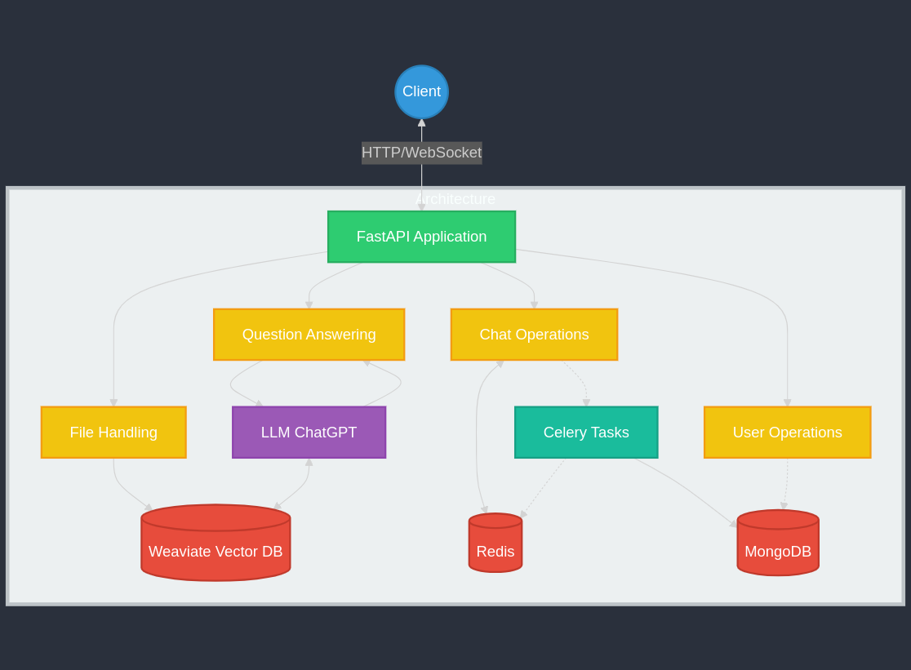

# LangChain Service

## Overview

The AskDocs Service is a FastAPI application offering functionalities including user management, file handling, real-time chat, and document-based question answering. It uses Redis for real-time chat, MongoDB for user data and chat history, Celery for task management, and Weaviate as a vector database for retrieval-augmented generation (RAG). LangChain is utilized to set up chains for question answering that call GPT-4 for generating responses based on document context.

## Architecture Diagram

Below is a visual representation of the AskDocs Service architecture:



This diagram illustrates the key components of the service and their interactions, including the FastAPI application, various operations (User, File, Chat, Question Answering), databases (Weaviate, Redis, MongoDB), and integration with LLM ChatGPT.


## Features

- **User Operations**: Manage users including creation, authentication, and retrieval.
- **File Handling**: Upload and process documents, clean the Weaviate database.
- **Chat Operations**: Real-time chat with Redis, chat history management with MongoDB, session handling.
- **WebSocket Support**: Real-time interaction through WebSocket endpoints.
- **Celery Tasks**: Background tasks for moving chat data between Redis and MongoDB.
- **LangChain Integration**: Setup of chains for question answering using GPT-4.
- **RAG Support**: Answer questions based on document context using Weaviate.

## Getting Started

### Prerequisites

- Docker
- Docker Compose
- Python 3.8 or later

### Setup

1. **Clone the Repository**

   ```bash
   git clone <repository_url>
   cd <repository_directory>
   ```

2. **Configure Environment**

   Copy the `.env.example` file to `.env` and configure the environment variables as needed.

   ```bash
   cp .env.example .env
   ```

3. **Build and Start Services**

   Use Docker Compose to build and start all services.

   ```bash
   make dev
   ```

4. **Check Service Status**

   Verify that all containers are running:

   ```bash
   docker-compose ps
   ```

   Check logs for each service if needed:

   ```bash
   docker-compose logs
   ```

## Endpoints

### User Operations

| Method | Endpoint               | Description                                    |
|--------|------------------------|------------------------------------------------|
| POST   | /user/users/           | Create a new user                             |
| GET    | /user/users/{user_id}  | Retrieve user by ID                           |
| GET    | /user/users/           | List all users                                |
| POST   | /user/token/           | Authenticate user and return JWT token        |
| GET    | /user/users/me         | Get the current user based on JWT token       |
| DELETE | /user/users/{user_id}  | Delete user by ID                             |

### File Handling

| Method | Endpoint            | Description                          |
|--------|---------------------|--------------------------------------|
| POST   | /data/upload-file/  | Upload a document and process it     |
| DELETE | /data/clean_db      | Clean Weaviate database              |

### Chat Operations

| Method | Endpoint                                      | Description                                      |
|--------|-----------------------------------------------|--------------------------------------------------|
| POST   | /chat/start                                   | Start a new chat session                        |
| GET    | /chat/session/{user_id}/                      | Retrieve chat history for a user                |
| GET    | /chat/{user_id}/{session_id}/redis_history    | Fetch chat history from Redis                   |
| POST   | /chat/redis                                   | Store chat session in Redis                     |
| DELETE | /chat/redis                                   | Delete chat session from Redis                  |
| GET    | /chat/{user_id}/{session_id}/history_mongo/   | Fetch chat session from MongoDB                 |
| POST   | /chat/mongo/                                  | Store chat session in MongoDB                   |
| PATCH  | /chat/mongo/                                  | Update chat session in MongoDB                  |
| DELETE | /chat/mongo/                                  | Delete chat session from MongoDB                |
| POST   | /chat/{session_id}/expire/                    | Expire session and move chat data to MongoDB    |
| POST   | /chat/question_aware_history                  | Ask a question with memory using RAG model      |
| POST   | /chat/question                                | Ask a question and get an answer from RAG model |
| GET    | /chat/conversations-messages                  | Retrieve all messages from a conversation       |
| POST   | /chat/move-chat-data/                        | Move chat data from Redis to MongoDB            |
| POST   | /chat/restore-chat-data/                     | Restore chat data from MongoDB to Redis         |

### WebSocket Endpoints

WebSocket endpoints are available under the `/socket` prefix. These are used for real-time chat functionality.

### Celery Tasks

Celery is used for background tasks. Task endpoints include:

| Method | Endpoint                      | Description                                      |
|--------|-------------------------------|--------------------------------------------------|
| POST   | /chat/move-chat-data/         | Trigger a task to move chat data to MongoDB     |
| POST   | /chat/restore-chat-data/      | Trigger a task to restore chat data to Redis    |


## LangChain Integration

LangChain is utilized to set up question-answering chains that call GPT-4 to generate responses based on the context provided by documents. The service uses LangChain to configure and manage these chains, enabling advanced conversational capabilities and context-aware question answering.

## RAG (Retrieval-Augmented Generation) with Weaviate

Weaviate is employed as a vector database for retrieval-augmented generation (RAG). It allows the service to perform efficient document-based retrieval to enhance the accuracy and relevance of the answers generated by GPT-4.


## Logging

Logging is configured for monitoring and debugging. Logs are available in the standard output and can be viewed using `docker-compose logs`.
